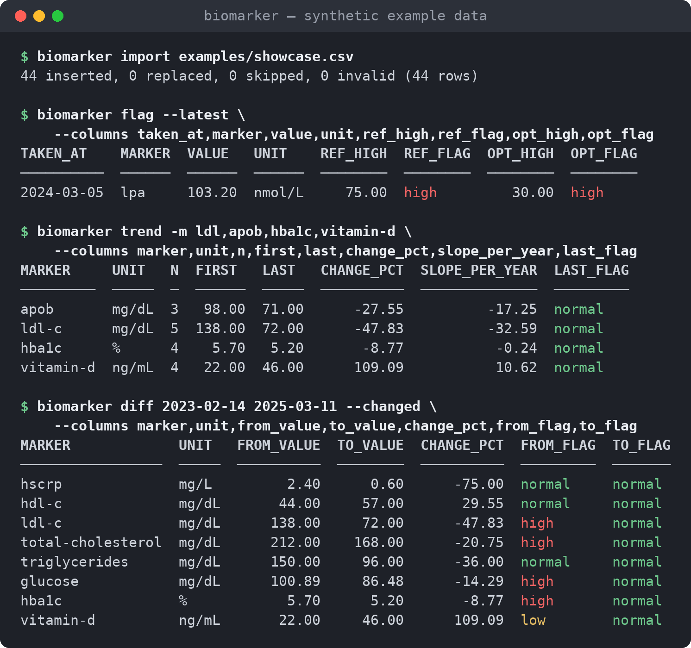

# biomarker-cli

Rust CLI for tracking biomarkers (lab results) across any number of people,
backed by [fsqlite](https://crates.io/crates/fsqlite) (FrankenSQLite, a
pure-Rust SQLite reimplementation). It builds a single binary, `biomarker`.

<p align="center">
  
</p>

## 60-second tour

A real session, run from a clone of this repo against the synthetic data in
[`examples/showcase.csv`](examples/showcase.csv) (two made-up people,
lab panels from 2023 to 2025). The transcript and the screenshot above are
generated by [`scripts/readme-session.sh`](scripts/readme-session.sh), not
edited by hand. `just readme` regenerates both, and `cargo test` fails when
this block no longer matches what the binary prints. The script pins
`BIOMARKER_TZ=UTC` and `SOURCE_DATE_EPOCH` so the output is reproducible.

<!-- readme-session:begin -->
```console
$ sh examples/people.sh
added person alex
added person sam

$ export BIOMARKER_PERSON=alex

$ biomarker import examples/showcase.csv
44 inserted, 0 replaced, 0 skipped, 0 invalid (44 rows)

$ biomarker latest -c lipid --units si
ID  PERSON  TAKEN_AT    MARKER             QUALIFIER  VALUE   UNIT    REF_LOW  REF_HIGH  FLAG    LAB
──  ──────  ──────────  ─────────────────  ─────────  ──────  ──────  ───────  ────────  ──────  ──────────────
18  alex    2024-03-05  lpa                           103.20  nmol/L              75.00  high    Synthetic Labs
38  alex    2025-03-11  apob                            0.71  g/L                  0.90  normal  Synthetic Labs
39  alex    2025-03-11  hdl-c                           1.47  mmol/L     1.03            normal  Synthetic Labs
37  alex    2025-03-11  ldl-c                           1.86  mmol/L               2.59  normal  Synthetic Labs
36  alex    2025-03-11  total-cholesterol               4.34  mmol/L               5.17  normal  Synthetic Labs
40  alex    2025-03-11  triglycerides                   1.08  mmol/L               1.69  normal  Synthetic Labs

$ biomarker flag --latest \
    --columns taken_at,marker,value,unit,ref_high,ref_flag,opt_high,opt_flag
TAKEN_AT    MARKER  VALUE   UNIT    REF_HIGH  REF_FLAG  OPT_HIGH  OPT_FLAG
──────────  ──────  ──────  ──────  ────────  ────────  ────────  ────────
2024-03-05  lpa     103.20  nmol/L     75.00  high         30.00  high

$ biomarker trend -m ldl,apob,hba1c,vitamin-d \
    --columns marker,unit,n,first,last,change_pct,slope_per_year,last_flag
MARKER     UNIT   N  FIRST   LAST   CHANGE_PCT  SLOPE_PER_YEAR  LAST_FLAG
─────────  ─────  ─  ──────  ─────  ──────────  ──────────────  ─────────
apob       mg/dL  3   98.00  71.00      -27.55          -17.25  normal
ldl-c      mg/dL  5  138.00  72.00      -47.83          -32.59  normal
hba1c      %      4    5.70   5.20       -8.77           -0.24  normal
vitamin-d  ng/mL  4   22.00  46.00      109.09           10.62  normal

$ biomarker diff 2023-02-14 2025-03-11 --changed \
    --columns marker,unit,from_value,to_value,change_pct,from_flag,to_flag
MARKER             UNIT   FROM_VALUE  TO_VALUE  CHANGE_PCT  FROM_FLAG  TO_FLAG
─────────────────  ─────  ──────────  ────────  ──────────  ─────────  ───────
hscrp              mg/L         2.40      0.60      -75.00  normal     normal
hdl-c              mg/dL       44.00     57.00       29.55  normal     normal
ldl-c              mg/dL      138.00     72.00      -47.83  high       normal
total-cholesterol  mg/dL      212.00    168.00      -20.75  high       normal
triglycerides      mg/dL      150.00     96.00      -36.00  normal     normal
glucose            mg/dL      100.89     86.48      -14.29  high       normal
hba1c              %            5.70      5.20       -8.77  high       normal
vitamin-d          ng/mL       22.00     46.00      109.09  low        normal

$ biomarker trend -m apob --format json | head -n 32
{
  "schema": "biomarker/v1",
  "kind": "trend",
  "generated_at": "2026-01-01T00:00:00Z",
  "count": 1,
  "unit_system": "canonical",
  "range_flavor": "reference",
  "windows": [
    "3m",
    "6m",
    "1y"
  ],
  "data": [
    {
      "person": "alex",
      "marker": "apob",
      "marker_name": "Apolipoprotein B",
      "category": "lipid",
      "unit": "mg/dL",
      "n": 3,
      "first_date": "2023-08-30",
      "last_date": "2025-03-11",
      "min": 71.0,
      "max": 98.0,
      "mean": 83.66666666666667,
      "median": 82.0,
      "stddev": 13.576941236277534,
      "first": 98.0,
      "last": 71.0,
      "change": -27.0,
      "change_pct": -27.55102040816326,
      "slope_per_year": -17.245010386047024,
```
<!-- readme-session:end -->

## Features

* Any number of people, with sex and date of birth for sex- and age-specific
  ranges.
* A built-in catalog of 70 markers you can extend: lipid panel, ApoB,
  Lp(a), CMP, CBC, thyroid, hormones, HbA1c, insulin, hs-CRP, homocysteine,
  vitamin D/B12, ferritin and iron studies, plus body composition and vitals
  (weight, BMI, body fat, biological age, resting HR, HRV, VO2 max, blood
  pressure). Each has aliases and, where one exists, a LOINC code.
* Reference ranges and separate *optimal* ranges, by sex and age band.
* Unit conversions per marker (mg/dL↔mmol/L, ng/dL↔nmol/L, HbA1c %↔mmol/mol,
  …). The raw value and unit are stored **and** a normalized canonical value.
* Import from CSV, TSV, JSON, JSONL and spreadsheets (xlsx, xls, ods), in
  long, wide or transposed (one row per test, one column per date) layout.
  Column mapping comes from flags or a TOML file. Imports support dry-run and
  a dedupe policy, and record an import batch.
* Qualitative results ("Negative", "1+ Abnormal") are kept as observations
  beside the numbers, and a person can have their own reference ranges.
* Query, latest, flag, trend (min/max/mean/median/stddev/slope, % change over
  windows) and diff.
* Every command supports `--format` (table, json, jsonl, csv, tsv, yaml,
  toon, markdown, html, org; see [Output formats](#output-formats)) and
  `--output FILE`. JSON uses a stable, versioned envelope (`biomarker/v1`, see
  [docs/json-schema.md](docs/json-schema.md)) so tools like `health-charts.el`
  can consume it.
* Layered configuration: defaults < TOML file < `BIOMARKER_*` env < flags.
  `config show --effective` shows where each value came from.
* **Encrypted at rest, with nothing to set up.** The database is an
  XChaCha20-Poly1305 sealed container, locked to your SSH key by default (or a
  private key file when there is none), on macOS, Linux and Windows alike. Add
  a passphrase or more SSH keys any time. An encrypted audit log records who
  did what. Exports can be age-encrypted. See [Encryption](#encryption).

> **Not medical advice.** The built-in ranges are typical adult values for
> orientation only. Labs differ, so set your lab's ranges with
> `biomarker range set`.

## Install

Prebuilt binaries for Linux (x86_64, aarch64), macOS (Apple Silicon, Intel)
and Windows (x86_64) are attached to every
[GitHub release](https://github.com/davidawad/biomarker-cli/releases), each
with a `.sha256` file and one `SHA256SUMS` for all archives. They need no Rust
toolchain. See [docs/platforms.md](docs/platforms.md) for what differs per OS
(key storage, file locations, permissions).

**macOS and Linux (Homebrew).**

```sh
brew install davidawad/tap/biomarker-cli
```

The formula installs the prebuilt release binary for macOS and Linux on
arm64 and x86_64, so no Rust toolchain is needed.

**Linux and macOS (prebuilt archive).** Pick the target for your machine:
`x86_64-unknown-linux-gnu` (glibc 2.35+), `aarch64-unknown-linux-gnu`,
`aarch64-apple-darwin` or `x86_64-apple-darwin`.

```sh
v=v0.6.0 t=aarch64-apple-darwin
curl -LO "https://github.com/davidawad/biomarker-cli/releases/download/$v/biomarker-cli-$v-$t.tar.gz"
curl -LO "https://github.com/davidawad/biomarker-cli/releases/download/$v/biomarker-cli-$v-$t.tar.gz.sha256"
shasum -a 256 -c "biomarker-cli-$v-$t.tar.gz.sha256"     # or: sha256sum -c
tar -xzf "biomarker-cli-$v-$t.tar.gz"
install -m 755 "biomarker-cli-$v-$t/biomarker" ~/.local/bin/
```

On macOS, binaries downloaded with a browser are quarantined; `curl` downloads
are not. Clear it with `xattr -d com.apple.quarantine ~/.local/bin/biomarker`.

**Windows (prebuilt archive, PowerShell).**

```powershell
$v = "v0.6.0"; $t = "x86_64-pc-windows-msvc"
$zip = "biomarker-cli-$v-$t.zip"
Invoke-WebRequest "https://github.com/davidawad/biomarker-cli/releases/download/$v/$zip" -OutFile $zip
(Get-FileHash $zip -Algorithm SHA256).Hash   # compare with $zip.sha256
Expand-Archive $zip -DestinationPath .
# put biomarker-cli-$v-$t\biomarker.exe on your PATH, e.g. in %LOCALAPPDATA%\Programs\biomarker
```

**From source (`cargo install`).** fsqlite needs a nightly toolchain on x86_64
and on Windows (see [Build](#build)); aarch64 builds on stable.

```sh
cargo +nightly install --locked --git https://github.com/davidawad/biomarker-cli   # x86_64, Windows
cargo install --locked --git https://github.com/davidawad/biomarker-cli            # aarch64
```

## Build

fsqlite 0.4 enables unstable Rust features on x86_64 (`core_intrinsics`, for
prefetch hints in its pager and B-tree) and on Windows (`windows_by_handle`, in
its VFS), so those targets need a **nightly** toolchain. No fsqlite feature
flag or newer release (checked up to 0.4.9) lifts this. `rust-toolchain.toml`
selects nightly automatically under rustup. aarch64 Linux and Apple Silicon
also build on stable (`cargo +stable build`), which CI checks. Release
archives are built by CI, so installing them needs no toolchain at all.

```sh
cargo build --release          # target/release/biomarker
cargo install --path .         # or install into ~/.cargo/bin
```

Debug builds of fsqlite use deep async state machines. The binary runs its
work on a thread with a 256 MiB stack, so no `ulimit` tweaks are needed.

## Quick start

```sh
biomarker db init
biomarker person add alex --name "Alex Example" --sex male --dob 1984-06-01
biomarker person add sam  --sex female --dob 1991-09-23
biomarker config set default_person alex

# single measurements (unit defaults to the marker's canonical unit)
biomarker add ldl 96 --date 2024-03-05 --lab "Synthetic Labs" --fasting
biomarker add glucose 5.1 mmol/L --date 2024-03-05      # stored as 91.9 mg/dL + raw 5.1 mmol/L
biomarker add hscrp "<0.5" --date 2024-03-05            # censored values keep their qualifier
biomarker add ferritin 38 --person sam --date 2023-11-20 --note "after iron supplement"

biomarker query                          # default person's measurements
biomarker query --all-people -c lipid --from 2023-01-01
biomarker latest --units si              # latest value per marker, SI units
biomarker flag --range-flavor both       # outside reference or optimal ranges
biomarker trend -m ldl,apob --windows 6m,1y
biomarker diff 2023-02-14 2024-03-05 --changed
```

Example table output:

```
ID  PERSON  TAKEN_AT    MARKER   QUALIFIER  VALUE  UNIT   REF_LOW  REF_HIGH  FLAG    LAB
──  ──────  ──────────  ───────  ─────────  ─────  ─────  ───────  ────────  ──────  ──────────────
 3  alex    2024-03-05  hscrp    <           0.50  mg/L                3.00  normal
 1  alex    2024-03-05  ldl-c               96.00  mg/dL             100.00  normal  Synthetic Labs
 2  alex    2024-03-05  glucose             91.88  mg/dL    70.00     99.00  normal
```

## Encryption

Everything biomarker writes about people is encrypted, and you do not have to
set anything up. The first command creates an encrypted database locked to
your SSH key (`~/.ssh/id_ed25519`, then `~/.ssh/id_rsa`; `%USERPROFILE%\.ssh`
on Windows). It tells you which key (path and fingerprint) and, on a terminal,
asks before using it:

```console
$ biomarker person add alex
biomarker: encrypting ~/.local/share/biomarker-cli/biomarker.db with your SSH key ~/.ssh/id_ed25519 (SHA256:…).
  How to open it again is written to ~/.config/biomarker-cli/config.toml (the [encryption] section). On another machine: copy ~/.ssh/id_ed25519 and the database there, then run `biomarker doctor`. Without that key the data cannot be recovered.
Encrypt with this SSH key? [Y/n]
```

From then on it just opens; nothing prompts. If your SSH key has a passphrase,
biomarker also makes a private key file so daily use stays prompt-free and the
SSH key becomes the recovery key. With no SSH key it uses a key file
(owner-only, under the config directory, refused if others can read it, like
ssh does). biomarker never uses the OS keychain, so it behaves the same on
macOS, Linux and Windows, and the keys move between machines.

```sh
biomarker key status            # which keys open the database, and how to recover it
biomarker key add-ssh ~/.ssh/laptop.pub   # another machine's key (or an offline recovery key)
biomarker key add-passphrase    # a passphrase you can write down
biomarker key remove 2
biomarker db rekey --to ssh     # replace every key with your SSH key
export BIOMARKER_KEY="raw:$(openssl rand -hex 32)"   # CI / scripts; or a passphrase
biomarker db encrypt            # migrate an existing plaintext database in place
biomarker doctor                # encryption, keys, permissions, audit-log check
biomarker audit log -n 20       # who did what (no values are logged)
biomarker export --recipient age1... -o labs.csv.age   # or --encrypt-output with a passphrase
```

Plaintext databases need `--insecure-plaintext` and print a warning every
time. `docs/security.md` covers the design and the threat model: an SSH key or
key file protects the data against the database (or a backup, or a synced
folder) being copied, not against programs running as you. Keep at least one
key somewhere else: lose them all and the data cannot be recovered.

## Commands

| command | purpose |
|---------|---------|
| `person add/list/show/edit/rm` | manage people (`--sex`, `--dob`, `--notes`, `--tag`) |
| `marker add/list/show/edit/rm/alias/categories` | manage the catalog. `edit --unit` rescales stored values and ranges |
| `range set/list/rm` | reference/optimal/warn (near-limit) ranges by `--sex` and `--age-min/--age-max`, or for one `--person`. `--unit` converts the bounds |
| `unit list [--symbols]`, `unit add-conversion`, `unit convert` | conversion table (`to = from * factor + offset`) |
| `add MARKER VALUE [UNIT]` | record one measurement (`--person --date --lab --fasting --note --tag --dedupe`) |
| `rm ID...` | delete measurements |
| `import FILE` | CSV/TSV/JSON/JSONL and xlsx/xls/ods import (see below) |
| `observations` / `obs` | qualitative results (`--flagged` for abnormal ones). Accepts the same filters as `query` |
| `export` | re-importable CSV (default), JSON or JSONL. Accepts the same filters as `query`. JSON also carries `observations` |
| `query` / `list` | filters: `-p/--person` (repeatable), `--all-people`, `-m/--marker`, `-c/--category`, `--from/--to`, `--last 90d`, `--lab`, `--tag`, `--batch`, `--flagged`, `--latest`, `--sort date\|person\|marker\|category\|value`, `-r`, `-n` |
| `latest` | latest value per person × marker |
| `trend` / `stats` | per-series statistics and `--windows` % change. JSON includes the points |
| `flag` | out-of-range values (`--latest`, `--exit-code` → status 10) |
| `diff FROM TO` | compare values at two dates (`--exact`, `--changed`) |
| `db path/init/migrate/backup/vacuum/check/info` | maintenance. Migrations are versioned and applied automatically |
| `key status/add-ssh/add-passphrase/add-file/remove` | the keys that can open the database |
| `db encrypt/rekey/unlock/lock`, `doctor`, `audit log` | encryption at rest, key management and the audit trail (see [docs/security.md](docs/security.md)) |
| `config show [--effective]/set/unset/path/keys` | configuration |
| `completions bash\|zsh\|fish\|nushell\|elvish\|powershell` | shell completions |
| `man [--dir DIR]` | roff man page(s) |

Global flags work on every command: `--format`, `--output`, `--units`,
`--precision`, `--date-format`, `--tz`, `--color`, `--delimiter`, `--quote`,
`--no-header`, `--null`, `--range-flavor`, `--columns`, `--db`, `--config`,
`-q`, `-v`.

## Output formats

`-f/--format` (or the `format` setting / `BIOMARKER_FORMAT`) picks one; names
are case-insensitive.

| format | aliases | shape | `--columns` | `--no-header` |
|--------|---------|-------|-------------|---------------|
| `table` | `text`, `plain` | aligned text table (default; colour on a TTY) | yes | — |
| `json` | | versioned `biomarker/v1` envelope | — | — |
| `jsonl` | `ndjson` | one record per line | — | — |
| `csv` | | RFC 4180, `--delimiter`/`--quote` | yes | yes |
| `tsv` | | tab-separated | yes | yes |
| `yaml` | `yml` | the JSON envelope as YAML | — | — |
| `toon` | | the JSON envelope as [TOON](https://toonformat.dev) (fewer tokens for LLM prompts) | — | — |
| `markdown` | `md` | GitHub-flavoured table | yes | ignored (GFM needs a header) |
| `html` | | `<table class="biomarker KIND">` | yes | yes |
| `org` | | Org-mode table (`C-c C-c` aligns it) | yes | yes |

The text formats (table, csv, tsv, markdown, html, org) honour `--precision`,
`--date-format` and `--null`; the structured ones (json, jsonl, yaml, toon)
keep exact stored values. `export` defaults to csv and, in json/yaml/toon,
also carries qualitative observations in the envelope.

## Importing

Long format is one measurement per row. The default columns are `person,
marker, value, unit, date`, plus optional `time, lab, fasting, note, tags,
qualifier`. Common synonyms such as `result`, `test`, `collected` and
`patient` are recognized automatically.

```sh
biomarker import examples/measurements.csv --dry-run
biomarker import examples/measurements.csv --dedupe replace
biomarker import examples/measurements.json         # array, or a biomarker/v1 export envelope
biomarker import examples/measurements.jsonl
cat labs.csv | biomarker import - --input-format csv --person sam
```

* Map columns with `--map FIELD=COLUMN` (repeatable or comma-separated), or
  with a TOML mapping file (`--mapping`) that can also set defaults, a date
  format and marker renames. See
  [`examples/lab-report-mapping.toml`](examples/lab-report-mapping.toml):

  ```sh
  biomarker import examples/lab-report.csv --mapping examples/lab-report-mapping.toml
  biomarker import export.csv --input-delimiter ';' --map marker=Analyte,date=Drawn --input-date-format %d.%m.%Y
  ```
* `--wide` reads one row per date with one column per marker. A header like
  `Glucose (mmol/L)` or `LDL [mg/dL]` sets the unit
  ([`examples/wide.csv`](examples/wide.csv)).
* `--dedupe skip|replace|error` decides what happens when a measurement
  already exists for the same person, marker and time. The default comes
  from config `dedupe`, else `skip`.
* `--dry-run` runs the whole import in a transaction and rolls it back, so
  the counts are exact.
* An invalid row aborts the import and writes nothing. Pass `--skip-invalid`
  to import the valid rows instead.
* `--create-people` and `--create-markers` add unknown slugs on the fly.
* `--person` sets the person for rows without one, and `--tag` tags every
  imported row. Each import gets a batch id, so you can query it with
  `query --batch ID`.
* Values may carry qualifiers (`<0.5`, `>= 90`), thousands separators
  (`1,000`) or a decimal comma (`2,1`).

Round trip: `biomarker export > all.csv`, then importing `all.csv` into an
empty database (with `--create-people`) reproduces the same export. The same
holds for `-f json` and `-f jsonl`.

## Import from a spreadsheet

`biomarker import` reads `.xlsx`, `.xlsm`, `.xlsb`, `.xls` and `.ods` files
directly. It is built for health dashboards kept in Excel, like the synthetic
[`examples/dashboard.xlsx`](examples/dashboard.xlsx). Its "Labs" sheet has
one row per test and one column per draw date, section rows such as
"Complete Blood Count (CBC)", metadata columns (Test, Notes, Control, Units,
Reference Interval, ref. low, ref. high) and a few qualitative cells. Its
"Body" sheet is a long log with one row per date and several value columns.
The mapping file is
[`examples/dashboard-mapping.toml`](examples/dashboard-mapping.toml).

<!-- readme-import:begin -->
```console
$ sh examples/people.sh
added person alex
added person sam

$ export BIOMARKER_PERSON=alex

$ biomarker import examples/dashboard.xlsx --list-sheets
INDEX  NAME  ROWS  COLUMNS  DIMENSIONS
─────  ────  ────  ───────  ──────────
    1  Labs    23       11  A1:K23
    2  Body     5        6  A1:F5

$ biomarker import examples/dashboard.xlsx --mapping examples/dashboard-mapping.toml \
    --create-markers --dry-run
import examples/dashboard.xlsx (xlsx, sheet "Labs", transposed layout, header row 3)
matched (11):
  White Blood Cell Count (WBC)      -> wbc
  Red Blood Cell Count (RBC)        -> rbc
  Hemoglobin (Hgb)                  -> hemoglobin
  Mean Corpuscular Volume (MCV)     -> mcv
  Platelets                         -> platelets
  Low-Density Lipoprotein (LDL-C)   -> ldl-c
  High-Density Lipoprotein (HDL-C)  -> hdl-c
  Apolipoprotein B (ApoB)           -> apob
  Hemoglobin A1c                    -> hba1c
  ALT (SGPT)                        -> alt
  Thyroid Stimulating Hormone (TSH) -> tsh
created (3): urine-protein, urine-appearance, urine-wbc
skipped by mapping (2): Lipoprotein Particle Score, Control Sample
qualitative (11, skipped; use --qualitative store to keep them):
  2024-03-01  urine-protein: Negative
  2024-08-15  urine-protein: Negative
  2024-12-04  urine-protein: 1+ Abnormal
  2025-03-11  urine-protein: Negative
  2024-03-01  urine-appearance: Clear
  2024-08-15  urine-appearance: Clear
  2024-12-04  urine-appearance: Clear
  2024-03-01  urine-wbc: None seen
  2024-08-15  urine-wbc: 0-5
  2024-12-04  urine-wbc: 6-10 Abnormal
  2025-03-11  urine-wbc: None seen
date corrections (1):
  2024-12-02 -> 2024-12-04 (13 values)
reference ranges from the sheet (12):
  wbc: 3.4..10.8 10^3/µL
  rbc: 4.14..5.8 10^6/µL
  hemoglobin: 13..17.7 g/dL
  mcv: 79..97 fL
  platelets: 150..450 10^3/µL
  ldl-c: 0..99 mg/dL
  hdl-c: 39.. mg/dL
  apob: ..90 mg/dL
  hba1c: 4.8..5.6 %
  alt: 0..44 U/L
  tsh: 0.45..4.5 mIU/L
  urine-wbc: 0..5 /hpf
values per date:
  2024-03-01  11
  2024-08-15  11
  2024-12-04  10
  2025-03-11  11
dry run: 43 inserted, 0 replaced, 0 skipped, 0 invalid (16 rows)

$ biomarker import examples/dashboard.xlsx --sheet Body \
    --value-column 'weight=Weight (lbs.):lb' --value-column 'bmi=BMI kg/m²'
import examples/dashboard.xlsx (xlsx, sheet "Body", long layout, header row 1)
matched (2):
  Weight (lbs.) -> weight
  BMI kg/m²     -> bmi
values per date:
  2024-01-06  2
  2024-04-06  2
  2024-07-06  2
  2024-10-05  2
8 inserted, 0 replaced, 0 skipped, 0 invalid (4 rows)

$ biomarker latest -m weight,bmi --units si --columns taken_at,marker,value,unit
TAKEN_AT    MARKER  VALUE  UNIT
──────────  ──────  ─────  ─────
2024-10-05  bmi     24.60  kg/m²
2024-10-05  weight  80.01  kg
```
<!-- readme-import:end -->

* `--sheet NAME` picks a sheet (default: the first). `--list-sheets` prints
  them with their dimensions.
* `--layout long|wide|transposed`. A sheet whose header row holds several
  dates is read as transposed unless you say otherwise. The header row is
  found automatically, or set it with `--header-row N` (1-based).
* Transposed sheets: `--marker-col`, `--unit-col`, `--ref-low-col` and
  `--ref-high-col` take a header name or a column letter. They default to
  columns named like Test, Units, ref. low and ref. high. Date columns are
  the header cells that read as dates: Excel date cells or serial numbers,
  ISO (`2024-12-04`) or US (`12/4/2024`) text.
* A row with a name but no values, unit or range is a section header. With
  `--sections-as-category` (the default for transposed sheets), markers
  created below it get a category from its title, so "Complete Blood Count
  (CBC)" becomes `cbc` and "Lipid Panel + ApoB" becomes `lipid`.
* `--value-column SLUG=HEADER[:UNIT]` (repeatable) imports several value
  columns from a long sheet. Without `:UNIT`, a unit in the header such as
  `Weight (lbs.)` is used. Pounds are converted to the catalog's kilograms.
* Test names resolve through slugs, aliases and names, ignoring case and
  punctuation, then by the part outside or inside parentheses:
  "Low-Density Lipoprotein (LDL-C)" becomes `ldl-c` and "ALT (SGPT)" becomes
  `alt`. Unmatched names are reported and skipped. `--create-markers` creates
  them instead.
* Units are normalised: `x10E3/uL` and `μm³ (x10E3/uL)` become `10^3/µL`,
  `μm³` becomes `fL`, `%Hb` becomes `%`. Units that equal the marker's
  canonical unit 1:1 are stored as it: `IU/L` becomes `U/L`, and `uIU/ml`
  becomes `mIU/L` for TSH.
* Qualitative cells ("Negative", "None seen", "6-10 Abnormal") are counted
  and skipped. `--qualitative store` keeps them in the `observations` table
  instead, with an `abnormal` flag and the range of values like `6-10`. List
  them with `biomarker observations`. A value with a trailing flag, like
  `105 H`, is imported as the number.
* The mapping file can also hold `[rename]` (source name to slug), `[units]`
  (source unit to spelling), `[dates]` (correct a column's date, e.g.
  `"2024-12-02" = "2024-12-04"`), `[skip]` (names to ignore), `[category]`
  (section or name to category), `[value_columns]`, `sheet`, `layout` and
  `header_row`. `ranges = "sheet"` (or `--ranges sheet`) turns the sheet's
  ref. low and ref. high into reference ranges for the imported person only,
  as `range set --person` would. Other people keep the catalog ranges.
* `--dry-run` prints the full report and writes nothing. A real import
  prints the same report. Re-importing the same sheet skips what is already
  there.

## Configuration

Settings resolve in this order, lowest to highest precedence:

1. built-in defaults
2. the config file: `--config FILE`, else `$BIOMARKER_CONFIG`, else
   `$XDG_CONFIG_HOME/biomarker-cli/config.toml` (default
   `~/.config/biomarker-cli/config.toml`; on Windows
   `%APPDATA%\biomarker-cli\config.toml`)
3. environment variables `BIOMARKER_*` (`NO_COLOR` is honoured too)
4. command-line flags

| key | env | default | values |
|-----|-----|---------|--------|
| `db_path` | `BIOMARKER_DB` | `$XDG_DATA_HOME/biomarker-cli/biomarker.db` (`~/.local/share/…`; Windows `%LOCALAPPDATA%\biomarker-cli\biomarker.db`) | path (`~` expanded) |
| `default_person` | `BIOMARKER_PERSON` | — | person slug |
| `format` | `BIOMARKER_FORMAT` | `table` | `table json jsonl csv tsv yaml toon markdown html org` |
| `date_format` | `BIOMARKER_DATE_FORMAT` | `%Y-%m-%d` | strftime. Used for text-format display, and accepted on input |
| `timezone` | `BIOMARKER_TZ` | `local` | `local`, `UTC`, IANA name, `+HH:MM` |
| `unit_system` | `BIOMARKER_UNITS` | `canonical` | a unit preset: `canonical us si uk` or your own (see Profiles) |
| `range_set` | `BIOMARKER_RANGE_SET` | — | a named range set (see Profiles) |
| `color` | `BIOMARKER_COLOR` | `auto` | `auto always never` |
| `precision` | `BIOMARKER_PRECISION` | `2` | decimals in text formats |
| `borderline_margin` | `BIOMARKER_BORDERLINE_MARGIN` | `0` | percent (0-100) of the range width inside a bound that counts as borderline; 0 = off |
| `range_specificity` | `BIOMARKER_RANGE_SPECIFICITY` | `sex` | `sex age`: which range wins when several match (sex-specific first, or narrowest age band first) |
| `trend_windows` | `BIOMARKER_TREND_WINDOWS` | `3m,6m,1y` | default `trend --windows` |
| `trend_min_points` | `BIOMARKER_TREND_MIN_POINTS` | `1` | default `trend --min-points` |
| `csv_delimiter` | `BIOMARKER_CSV_DELIMITER` | `,` | one char or `tab` |
| `csv_quote` | `BIOMARKER_CSV_QUOTE` | `"` | one char |
| `csv_header` | `BIOMARKER_CSV_HEADER` | `true` | bool |
| `null` | `BIOMARKER_NULL` | empty | text for missing values |
| `range_flavor` | `BIOMARKER_RANGE_FLAVOR` | `reference` | `reference optimal both` |
| `dedupe` | `BIOMARKER_DEDUPE` | `skip` | `skip replace error` (import) |
| `quiet` / `verbose` | `BIOMARKER_QUIET` / `BIOMARKER_VERBOSE` | `false` | bool |

```sh
biomarker config set unit_system si
biomarker config show --effective
biomarker config keys
```

```
KEY             VALUE                                     SOURCE
───             ─────                                     ──────
db_path         /home/me/.local/share/biomarker-cli/...   default
default_person  alex                                      file
format          table                                     default
unit_system     si                                        file
precision       3                                         env
...
```

macOS uses the same XDG-style paths as Linux (as every release so far has),
not `~/Library/Application Support`, so existing databases stay where they
are. `XDG_CONFIG_HOME` / `XDG_DATA_HOME` are honoured on every OS. See
[docs/platforms.md](docs/platforms.md#file-locations).

The config file is flat TOML. One level of tables is flattened, so
`[csv] delimiter = ";"` is the same as `csv_delimiter = ";"`. See
[`examples/config.toml`](examples/config.toml).

## Profiles: unit presets, range sets, per-person settings

Everything below is optional TOML next to `config.toml` (`biomarker config path`
shows where). `biomarker profile list` shows what is loaded and from which
file; `biomarker profile show PERSON` shows the units and ranges in effect for
one person and where each range came from. A mistake in a file is an error
that names the file.

**Unit presets**: `units/<name>.toml`. Built in: `canonical`, `us`, `si`, `uk`.
Select one with `unit_system` / `--units`.

```toml
# units/mass-per-ml.toml
description = "mg/mL style"
extends = "us"                    # inherit another preset
[units]
glucose = "mg/mL"                 # marker slug or alias
"@lipid" = "mmol/L"               # a whole category
[[conversion]]                    # only if the conversion is not already known
marker = "glucose"
from = "mg/dL"
to = "mg/mL"
factor = 0.01
```

A `[units]` table in `config.toml` overrides single markers on top of the
global preset. A per-marker display unit must be reachable by a conversion; one
that is not is an error, not a silent fallback.

**Range sets**: `ranges/<name>.toml` is a list of `[[range]]` entries (`marker`,
`kind`, `sex`, `age_min`, `age_max`, `low`, `high`, `unit`, `lab`, `note`),
optionally `extends = "<set>"`. Select one globally with `range_set`, or per
person. An entry with `lab = "quest"` applies only to results from that lab, and
when any entry matches a result's lab only those are used.

**Person profiles**: `people/<slug>.toml` (`biomarker profile init PERSON`
writes a starter).

```toml
unit_preset = "si"                # this person's units (a --units flag still wins)
range_set = "labcorp"
[units]
glucose = "mg/dL"
[[range]]                         # personal ranges: bands, units and labs allowed
marker = "ldl-c"
kind = "optimal"
high = 1.8
unit = "mmol/L"
```

Range precedence per measurement: the person's own ranges (profile file, then
`range set --person`), then their (or the global) range set, then the catalog.

**Critical and borderline levels.** `[[range]]` entries (in range sets and
person profiles) accept `critical_low` / `critical_high`. With
`borderline_margin = 10` in `config.toml`, a normal value within 10% of the
range width of a bound is `borderline-low` / `borderline-high`. JSON records
carry `level`, `ref_level` and `opt_level`; the `flag` fields are unchanged.
`biomarker flag --critical` lists only critical results, `flag --borderline`
adds borderline ones.

**Near-limit (warn) ranges.** `kind = "warn"` entries (in range sets, person
profiles or `range set --kind warn`) give the bounds of a near-low / near-high
zone; they are picked by sex, age and person like the other kinds. JSON
records carry `warn_low`, `warn_high` and a `status` (`low`, `near-low`,
`in-range`, `near-high`, `high`, `unknown`) judged against the reference
range. The catalog ships default warn zones, taken from common clinical
cut-offs:

| Marker | Near-limit zone | Meaning |
|---|---|---|
| Glucose (fasting) | 100-125 mg/dL | prediabetes |
| HbA1c | 5.7-6.4 % | prediabetes |
| Total cholesterol | 200-239 mg/dL | borderline high |
| LDL-C | 100-159 mg/dL | near optimal to borderline high |
| Triglycerides | 150-199 mg/dL | borderline high |
| eGFR | 60-89 mL/min/1.73m² | mildly decreased |
| Systolic blood pressure | 120-129 mmHg | elevated |

These are defaults, not medical advice: check them against your own
guidelines and lab, and override them like any other range, with
`range set --kind warn` (by sex, age or `--person`) or `kind = "warn"`
entries in a range set or person profile.

**Per-person flavor.** `range_flavor = "optimal"` in a person profile; an
explicit flag or environment variable still wins.

**Display precision per marker.** `precision` is the default number of
decimals in text formats (JSON stays exact). Override it per marker slug or
`@category`, globally and per person:

```toml
# config.toml
[marker_precision]
glucose = 0
"@cbc" = 1
```

The same `[marker_precision]` table works in `people/<slug>.toml` and wins
there. Aliases are not matched: use the slug or `@category`.

**Unit spellings.** Teach the importer extra spellings in `config.toml`:

```toml
[unit_aliases]
"mg per dl" = "mg/dL"
"gms/dl" = "g/dL"
```

**Your own markers.** `markers.toml` next to the config file creates or
updates catalog markers; `biomarker marker sync` (`--dry-run`, `--file F`)
applies it and is idempotent. An existing marker keeps its unit.

```toml
[[marker]]
slug = "ferritin-x"
name = "Ferritin X"
category = "iron"
unit = "ng/mL"
aliases = ["ferr-x"]
[[marker.conversion]]          # into the marker's unit
from = "pmol/L"
factor = 0.445
[[marker.range]]               # catalog ranges: sex / age bands, unit, kind
sex = "male"
low = 30
high = 400
```

Not configurable on purpose: the duplicate key of a measurement (person,
marker, date) and the length of a year used for slopes and ages (365.2425
days). Critical bounds live in range sets and profiles, not the catalog.
Which range wins when several match is the `range_specificity` setting.

## Machine interface

`biomarker query --format json` and `biomarker trend --format json` return a
versioned envelope:

```json
{"schema": "biomarker/v1", "kind": "trend", "count": 1, "data": [{"person": "alex", "marker": "ldl-c", "n": 4, "slope_per_year": -24.9, "points": [...]}]}
```

The fields, all `kind`s, the error object, and the exit codes (0 ok, 1 error,
2 usage, 3 not found, 4 invalid data, 5 database, 6 io, 7 config, 8 key, 10 flagged
values with `flag --exit-code`) are documented in
[docs/json-schema.md](docs/json-schema.md).

## Data model

SQLite schema, managed by versioned migrations in `src/migrations.rs` and
tracked in `schema_migrations` and `PRAGMA user_version`:

* `people(id, slug, name, sex, dob, notes, tags, created_at)`
* `markers(id, slug, name, category, unit, loinc, description, builtin)` and
  `marker_aliases(alias, marker_id)`
* `units(symbol, system)` and `unit_conversions(marker_id|0 = generic,
  from_unit, to_unit, factor, offset)`
* `ranges(marker_id, kind reference|optimal|warn, sex any|male|female, age_min,
  age_max, low, high, note)` and `person_ranges(person_id, marker_id, kind,
  low, high, note)`, which win over `ranges` for that person
* `measurements(person_id, marker_id, taken_at, value_raw, unit_raw, value
  (canonical), qualifier, lab, fasting, note, tags, batch_id, created_at)`.
  It is unique on (person, marker, taken_at).
* `observations(person_id, marker_id, taken_at, text, flag, range_low,
  range_high, note, lab, batch_id, created_at)` for qualitative results. It
  is unique on (person, marker, taken_at).
* `import_batches(id, source, format, created_at, row_count)`

## Development

```sh
cargo fmt
cargo clippy --all-targets -- -D warnings
cargo test        # unit tests + assert_cmd integration tests (tests/cli.rs)
just test-gate    # all three, as run before merging (CI runs them on all five targets)
just readme       # regenerate the README sessions and hero screenshot (needs uv)
cargo run --example make-sheets   # regenerate examples/dashboard.xlsx
```

All data in `examples/` is synthetic.
